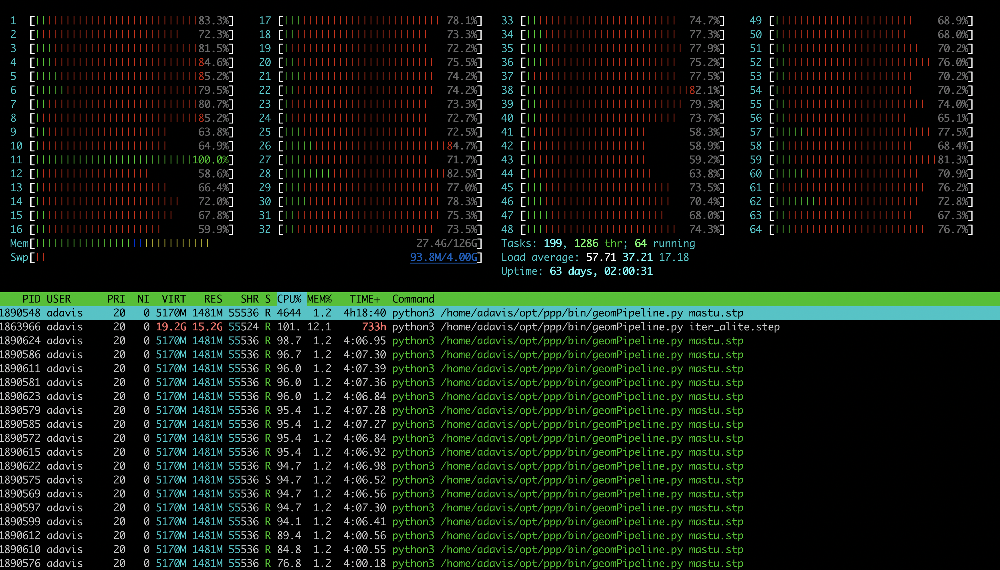

# Parallel-preprocessor (PPP)

A prototype parallel CAE geometry preprocessing framework

by Qingfeng Xia, UKAEA

Copyright 2019-2020 UKAEA

License: LGPL v2.1

## Documentation

For more information, please see the
[**documentation website**](https://ukaea.github.io/parallel-preprocessor/site/doxygen-docs.html) (which includes the contents of this Readme file).

## Feature overview

This software provides multi-threaded geometry **collision detection and imprinting** via a command line interface. It has faster and more controllable performance on **large geometry assemblies (with 10k+ parts)** than is possible with most existing CAD tools.

The following screenshot shows the software making good use of multiple CPUs, with high CPU usage across 64 threads on a 32-core CPU.  (Source: Dr Andrew Davis)

## Getting started

A quick start guide for using PPP can be found in [wiki/GetStarted.md](wiki/GetStarted.md).

## Future plans

This software aims to be a framework for more CAE preprocessing operations for large geometry assemblies with up to 1 million parts, such as fusion reactors, aeroplanes and aero engines, using high performance computing infrastructure in exascale supercomputers. Eventually, automatic and intelligent engineering design will be enabled through this framework and other software tools.

[wiki/TechOverview.md](./wiki/TechOverview.md) explains more about why a parallel preprocessor is needed in the era of exascale computing.

[wiki/Roadmap.md](wiki/Roadmap.md) lists short-term and long-term plans which depend on funding status. Additional funding for enhancing existing modules or developing new modules would be very welcome.

## Disclaimer

This is **not** yet production quality software, but is a prototype which demonstrates the potential of accelerating CAE preprocessing on HPC systems. We hope to improve the software and apply better software engineering practices in future.

**There is no warranty for this free library.**

## Platforms supported

This project has been designed to be cross-platform, and currently a number of Linux distributions are supported:

+ The latest LTS version of Ubuntu is the primary development platform, and a Debian package is generated by the CI build.

+ Fedora 30+ with OpenCascade 7.x package available from official repository, with an RPM binary package generated.

+ MacOS compiling and packaging is done via homebrew, with a DragNDrop binary package generated.

+ Windows 10 users are encouraged to use WSL with one of the supported Linux distributions. (A guide to native compilation on Windows has been added, but this build is experimental.)

+ Versions can be built from the source code for other Linux platforms (using CMake and CPack).  Centos8 should work without much effort (with OpenCascade compiled from source). The build tools in the Centos7 software stack are too old, so Docker/Singularity should be used for Centos7 support.

+ Centos8 **Docker image** is ready for quick started without installation
`docker pull qingfengxia/ppp-centos`
This is a small image (size 1.6 GB) based on centos8, with only occt (v7.4)  and PPP compiled from source.

+ Conda packages may be available in the future. See [wiki/Packaging.md](wiki/Packaging.md).

## Installation guide

There are instructions for installation in [wiki/Installation.md](wiki/Installation.md).  Runtime dependencies must be installed before PPP release packages (and the easiest way to do this is probably by installing FreeCAD).

## Developer guide

Information for developers, such as a guide for building from source, and documentation about the software design and implementation, can be found in [wiki/DeveloperGuide.md](wiki/DeveloperGuide.md).

## Contributions

Please submit GitHub issues and pull requests!

See more about the workflow for contributions in [wiki/Contribution.md](wiki/Contribution.md).

## Acknowledgements

Funding from August 2019 - April 2020 was provided by the [STEP project in UKAEA](http://www.ccfe.ac.uk/step.aspx).

Dr Andrew Davis of UKAEA, has contributed his technical insight,  test geometries and other support to this software project. Also thanks to other colleagues, including John Nonweiler and Dr Jonathon Shimwell, for testing and reviewing this software.
