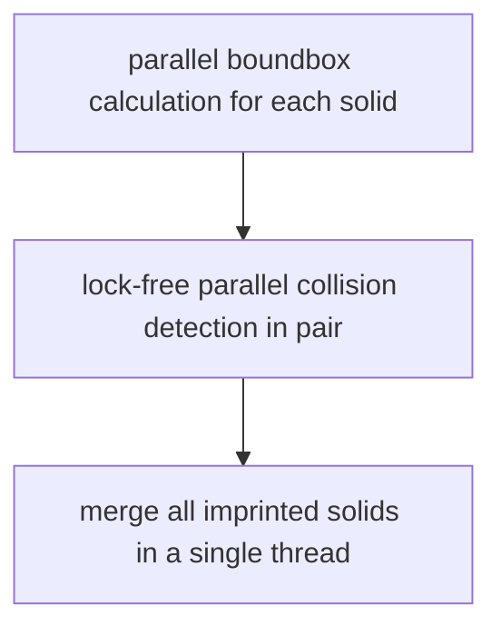
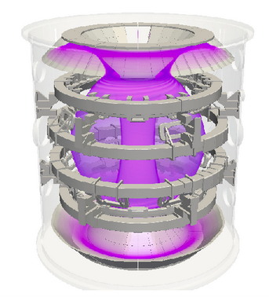
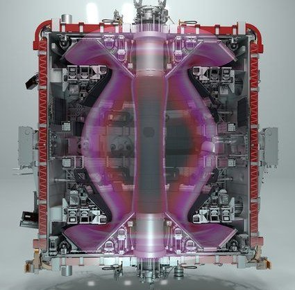

## Benchmark on parallel imprinting

by Qingfeng Xia

### Why assemble merge (Boolean fragment)?   

Parts in assembly are spatially in contact with faces in the same space, but they are independent (not connect, not sharing face ) In this situation, heat can not transfer from one part into another part in contact, which inviolate physical rule.  In order to conduct a simulation, part in contact should share the face.  For a assembly with faces in contact, they should be merge into a single data structure, to keep face sharing topology. 

However, vendor-independent neutral geometry file format can not save the sharing faces between solids, but CAD kernel specific format like `*.brep` for OpenCASCADE, `*.sat` for a commercial CAD kernel. 

Boolean operation is expensive, each face will be discretized into surface mesh then for interference detection. Precision also increase the computation time for curved surfaces. 

### Imprint algorithm

source code <../src/Geom/CollisionDetector.cpp>

source code <../src/Geom/GeometryImprinter.cpp>

#### Collision detection by bounding box

Compared with collision detection by pave-filling, boundbox calculation is cheaper.  Boundbox is used to build a sparse matrix \f$ M_{ij} \f$, to indicate potential contact for a given pair of $solid_i$ and $solid_j$

#### Lock-free parallel imprint

source code <../src/App/AsynchronousDispatcher.h>

Given the adjacency sparse matrix  \f$ M_{ij} \f$,   if thread 1 is operating on the `pair (i, j)`, then thread 2 must operating on another `pair (k, l)`, where 

\f$ M_{i,j} = M_{k,l}= true \f$ means part i and j are potential in contact, and part `l` and `k` are potential in contact.

 \f$ M_{i,k} = M_{i,l}= M_{j,k} = M_{j,l}=false \f$  means the `pair (i,j)` are both non-adjacent to the `pair (k, l)`

#### Merge 

Merge is currently in a single thread, not yet parallelized.

### The scaling of imprint operation

The scaling of geometry boolean operations.  for equal cubes stack together, there are maximum 6 other cubes in contact.  The total boolean operations (for 2 solid in contact as one operation) grows linearly with total solid number, but in practice. Potential contact are filtered by **boundbox** interference detection. 

[refer to PaveFiller of OCCT](https://old.opencascade.com/doc/occt-7.5.0/overview/html/occt_user_guides__modeling_algos.html#occt_modalg_5)

For a realistic assembly, especially for an apparatus with shell for decorating or protection purpose, most of smaller parts enclosed by the shell, will not be excluded from expensive collision check operation. To make thing worse, only one thread on operation on this shell part, means non parallel acceleration. It is found single thread is working on last 3~5% job.

### Limitation of existing imprint tools

Geometry imprinting and merging is an essential feature of CAD software, which are available in major commercial CAD software tools and CAE preprocessor tools. However, imprinting and merging can be challenging to deal with imperfect geometry from design office, especially for large assembles. 

+ speed:  computation time increases faster than the linear relationship with part number. for a assembly more than several handreds parts, massively parallel is desired.

+ user control: Precision user control over the geometry check, fixing, imprinting and merging are required. 

+ Robustness:  For a large assembly, there are always some parts fail to do boolean operation, which leads to error in CAD software. This parallel-preprocessor can be configured to ignore those parts that can not do boolean operation .  

  

Note: Failed BOP leads to exception, imprint can not be completed.  can not benchmark on most existing CAD tools.  Geometry fixing is not implemented currently. 

Open source tool based on OpenCACADE CAD kernel

1. FreeCAD:  the leading open source full featured CAD and CAE software
2. [Gmsh 3.x and above ](https://gitlab.onelab.info/gmsh/gmsh/) : 2D and 3D meshing tool, also have FEA feature
3. Salome Platform: integrated CAX platforms similar with Ansys workbench

Commercial software might have license restriction on benching marking 

### Example MAST upgrade prototype

MastU.step:  prototype of MAST upgrade fusion reactor, early stage prototype without manufacturing details. This assembly has 1052 solid parts and it is 106 MB in file size,  1.6 GB memory usage after loaded into FreeCAD. 

This picture of MASTU is available on intranet <https://users.mastu.ukaea.uk>

Image source: [BBC: UK fusion experiment used in hunt for clean energy
](https://www.bbc.co.uk/news/science-environment-54741375)

#### Imprint mustU.stp on FreeCAD 

In GUI mode of FreeCAD, select all parts and do "boolean fragments",  FreeCAD program got killed  2 minutes later (reason not know, maybe out of memory). 

Secondly, select about 100 parts from the object trees and do  "boolean fragments",   system dialog "Wait or force quit" pop up but can be ignored.  memory usage 1.6 G  goes up to 3.2 GB in 15 minutes later.  "boolean fragments" can be completed.

Source code of FreeCAD shows, it does not use boundbox to exclude the parts far away, which means any pair of solids has gone through the expensive bool operation process. Without an official assembly module, FreeCAD is not designed to deal with large geometry assembly. 

#### Imprint on a commercial CAD tool

One commercial CAD tool using commercial CAD kernels.  it is possible to merge 1000 solids in GUI mode, but needs it several round of operation as at most 250 solids are selected to do boolean fragment, and there is no clear hint that all merge has been completed.  

Single thread is used, although boundbox may involved to exclude some unnecessary bool operation.

#### Imprint with PPP with 1~6 CPU cores

### Performance of parallel preprocessor

#### Benchmark environment

Tested on Ubuntu 18.04

+ intel i5 8650 CPU 6 cores CPU, max frequency 3.6 GHz,  in debug mode.

+ AMD Ryzen Threadripper 2990WX 32-Core Processor (Base Clock 3.0GHz)

This PPP software under benchmarking is compiled in debug model, while the performance mainly depends on low-level API OCCT build type. can be compiled with `-o2` option in release mode to gain better performance.

#### Introduction to assembly files

+ mastu.stp: as described above
+ PipeVessel.stp: it is a geometry full of pipelines,  it is an example of fast parallel processing on the loosely coupled problem (most of parts are not tightly clustering together) . 
+ iter-clite.stp:  prototype of ITER fusion reactor, early stage prototype without manufacturing details, suitable for physical simulation. 
+ iter-alite.stp:  slightly different version of iter-clite.stp, with total parts number doubled.

| geometry name  | Solid count | imprint (6 cores) | imprint (32 cores) | merge     |
| -------------- | ----------- | ----------------- | ------------------ | --------- |
| mastu.stp      | 1 thousand  | 3 minutes         | 1 minutes          | 3 minutes |
| PipeVessel.stp | 6 thousand  | about 1.5 hours   | 25 minutes         | failed    |
| iter-clite.stp | 5 thousand  | about 6 hours     | not tested         | failed    |
| iter-alite.stp | 12 thousand | 26 hours          | 13 hours           | fine      |

Notes:  
1) For mastu project,  4 parts failed in BOP check are not disabled, due to self-intersect error.  Furthermore, mastu imprinted and merged geometry can be  volume meshed by gmsh 4.x using multi-threading for FEA. 

2) PipeVessel:   Issues found: Segmentation Fault when dump/save some solids.  Failed to merge

#### Analysis

iter-clite: is an good example of deeply-coupled geometry (parts sitting closely to each other with bound box overlapping) there are several parts has bound box overlapping with all the rest, so half of the processing time only 1 or 2 CPU cores are busy)

### Evaluation using public available geometry

Free available example assembly FreeCAD model

https://forum.freecadweb.org/viewtopic.php?f=24&t=38602&start=10

### Future plan on geometry imprinting 

+ parallel merge

+ alternative way for collision detection if some parts can not achieve bool operation

+ improve the algorithm to exclude parts that are not in contact, currently boundbox is used.

+ robustness to handle problematic part

  